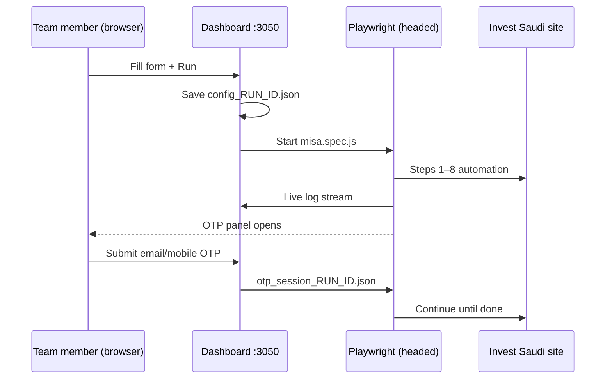

# How your company uses this system (always on)

You host the **automation runner** 24/7. Your company can use **either**:

1. **Their own dashboard** — recommended: their devs call `POST /api/v1/runs` (see [EXTERNAL-API.md](./EXTERNAL-API.md))
2. **Your built-in dashboard** (`index.html`) — same backend, optional for testing

You (IT/admin) keep the server, OpenAI key, and API key; they only integrate HTTP APIs.

---

## Who does what

| Role | What they do |
|------|----------------|
| **Your team** (operators) | Open dashboard → enter company data + files → **Run** → enter OTP when the panel appears → watch live log |
| **You** (admin) | Keep Windows server + PM2 + ngrok running, `.env` (OpenAI), deploy updates, fix failures |

Operators never install Node, Playwright, or OpenAI keys. Only the server has those.

---

## What happens when someone clicks Run



1. Dashboard saves the form to `config_<runId>.json` (and `config.json` as latest).
2. Server starts `npx playwright test tests/misa.spec.js --headed` on **your machine**.
3. Log streams in the browser in real time.
4. At OTP, the **OTP Verification** panel appears; operator types codes from email/SMS.
5. When finished, success or error appears in the log.

---

## Keep the project live forever (24/7)

Automation needs a **Windows PC or server that stays on**, with a logged-in session (headed browser).

### One-time server setup

```powershell
cd d:\Dadda\Desktop\playwright\playwright-cli
npm install
npx playwright install chromium

# .env — OpenAI (charge account when ready)
# RUN_AI_FALLBACK=1, OPENAI_API_KEY=sk-...

pm2 start ecosystem.config.js
pm2 save
```

### Start dashboard after every reboot

```powershell
npm install -g pm2-windows-startup
pm2-startup install
pm2 save
```

After a reboot, PM2 should restart `misa-dashboard` automatically.

### Public URL for your team (ngrok)

```powershell
.\start-dashboard-ngrok.bat
```

Share the **https://….ngrok-free.app** link with your team (or use a fixed ngrok domain on a paid plan).

See [NGROK.md](./NGROK.md).

### Health checks

```powershell
pm2 status
pm2 logs misa-dashboard --lines 50
```

Dashboard up → open `http://localhost:3050` (or your ngrok URL).

| Check | OK if |
|-------|--------|
| PM2 | `misa-dashboard` status **online** |
| Port | Browser opens dashboard |
| OpenAI | Log shows `AI recovery: ENABLED` (after you add billing) |
| Browser | Server user is logged in (RDP); do not lock screen during runs |

### What “live forever” means in practice

- **Dashboard** (`server.js`) — PM2 keeps it running; restarts if it crashes.
- **Each Run** — starts a new Playwright process; ends when the test finishes.
- **Only one Run at a time** is safest today (one headed browser). If two people click Run together, runs can conflict — tell the team to wait for the current run to finish.

---

## Give your team the dashboard (they don’t install anything)

1. Start PM2 + ngrok (or host on a VPS with port 3050 + HTTPS reverse proxy).
2. Send them the URL (e.g. `https://your-company.ngrok-free.app`).
3. Optional: protect with VPN or ngrok OAuth if you don’t want a public URL.

They use the **same** `index.html` you use now: registration fields, shareholders, files, **Run**, OTP panel.

---

## Upgrade the workflow later (without breaking production)

Split what you change:

| Layer | Files | When to change |
|-------|--------|----------------|
| **Form / UI** | `index.html` | New fields for operators |
| **Defaults & engine steps** | `site_data/misa_config.json` | New dropdown values, step order for Steps 1,2,5,6 |
| **Brittle screens** | `tests/misa.spec.js` (`runMisaStep3/4/7/8`) | MISA UI changed on Apply, ISIC, Contact, Preview |
| **AI recovery** | `utils/recoveryAgent.js`, etc. | Smarter recovery rules |
| **Infrastructure** | `server.js`, `ecosystem.config.js` | API, ports, spawn options |

### Safe upgrade procedure

```powershell
# 1. Stop new runs (wait for current run to finish)
pm2 stop misa-dashboard

# 2. Backup
cd d:\Dadda\Desktop\playwright\playwright-cli
mkdir backup_%date:~-4% 2>nul
copy site_data\misa_config.json backup_%date:~-4%\
copy .env backup_%date:~-4%\

# 3. Pull or copy new code
git pull
# or unzip new playwright-cli over old folder (keep .env and server-config.json)

# 4. Install deps if package.json changed
npm install
npx playwright install chromium

# 5. Restart
pm2 restart misa-dashboard
ngrok http 3050   # if you use ngrok manually
```

### Test before telling the team

```powershell
npx playwright test tests/misa.spec.js --headed
```

Or one test run from the dashboard with fake data.

### Version tag (optional)

After each deploy, note the git commit or date in your internal wiki. Logs include `WORKFLOW VERSION` when set in `misa.spec.js`.

---

## OpenAI billing (your account only)

- One `.env` on the **server** — your company pays once.
- Team members never see the API key.
- After you add credits, keep `RUN_AI_FALLBACK=1` and `pm2 restart misa-dashboard`.

---

## Files to never lose on the server

| File | Why |
|------|-----|
| `.env` | OpenAI + AI flags |
| `server-config.json` | Dashboard API key |
| `site_data/misa_config.json` | Step templates |
| `uploads/` | Uploaded CR/FS files per run |

These are in `.gitignore` — back them up when you upgrade.

---

## Quick troubleshooting

| Problem | Fix |
|---------|-----|
| Dashboard won’t open | `pm2 restart misa-dashboard` |
| Run starts but no browser | Log into Windows (RDP); run headed only on desktop session |
| AI doesn’t help | Add OpenAI balance; check `.env`; `pm2 restart` |
| OTP stuck | Operator must submit OTP in panel; check email/SMS |
| ngrok URL changed | Restart ngrok; send team the new link (or use reserved domain) |

---

## Summary

- **One dashboard** hosted by you — team only fills the form and clicks **Run**.
- **Always on** = Windows server + `pm2` + optional ngrok + don’t lock the machine during runs.
- **Upgrade later** = update code/config on the server, `npm install`, `pm2 restart`, test once — operators keep using the same URL.
